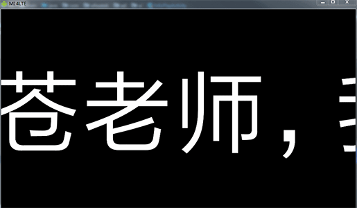

# AndoidMarqueeView

Android 走马灯效果，可自定义文字大小，颜色，速度等，使用双缓冲异步加载机制，解决了传统方式滚动卡顿的问题。

**Preview**

Configuration
----
* `app:fontSize="256"` 字体大小
* `app:fontColor="#ffffff"` 字体颜色

## License

`AndoidMarqueeView` is released under the Apache License version 2.0.